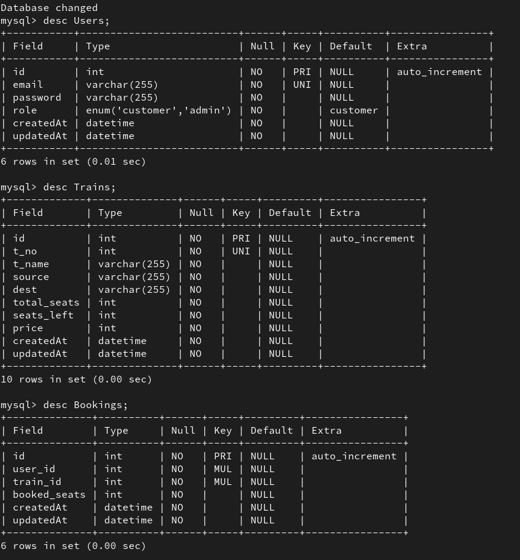

# Railway Management System

## Setup Instructions

Follow these steps to set up the project:

1. **Clone the Repository:**

   ```bash
   git clone <repository_url>
   cd railway_api

   ```

2. **Install Dependencies:**

```bash
npm i
```

3.  **Database Configuration:**
    Create a MySQL database named irctc_db.

```bash
npx sequelize db:create
```

4.  **Database Migration:**

```bash
npx sequelize db:migrate
```

**Run the Application:**

```bash

npm start

```

**API Endpoints**

/register (POST): Register a new user.

/login (POST): Log in to an existing user account.

/train (POST): Add a new train (accessible only to admins).

/train (GET): Get seat availability between two stations. (by entering source and destination)

/booking (POST): Book a seat on a particular train.

/booking (GET): Get booking details of user logged in.

Authentication
The API uses JSON Web Tokens (JWT) for authentication.
Admin endpoints require an authorization token for authentication.
User-specific endpoints require an authorization token obtained after login.


**Database screenshot:**
